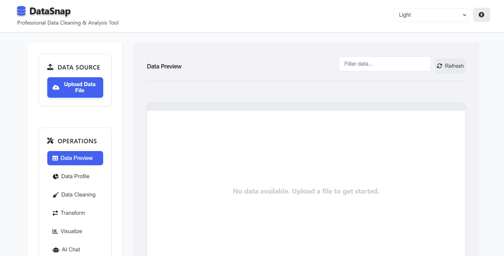
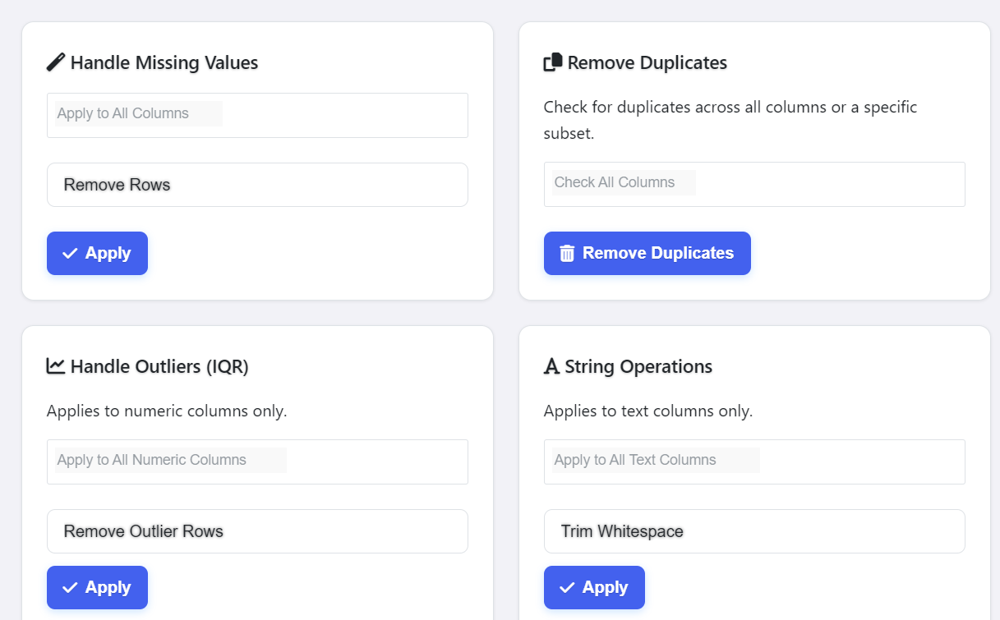
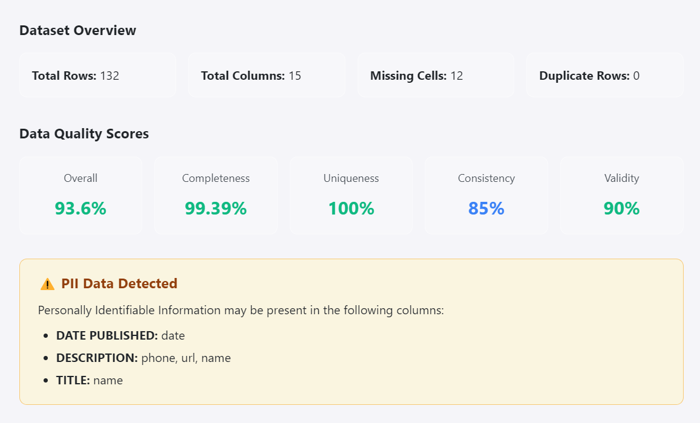
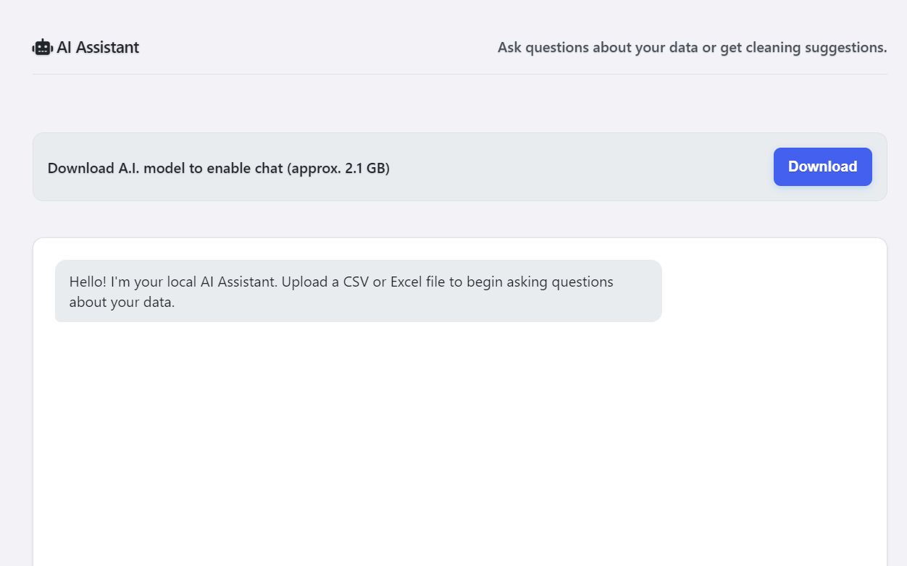

<div align="center">

# DataSnap

### Local-First Desktop Data Cleaning, Transformation, and Analysis

DataSnap is an offline desktop application for cleaning, transforming, profiling, visualizing, and exporting datasets without uploading sensitive information to external services.

Built with **Electron**, **Python**, **Flask**, and **Pandas**.

<br>


</div>

---

## Overview

DataSnap provides a visual workspace for preparing and analyzing datasets without requiring command-line tools or cloud services.

Users can import a dataset, inspect its structure, identify quality problems, apply cleaning operations, create transformations, explore charts, and export the finished data from one desktop application.

An optional local AI assistant can also provide dataset explanations and cleaning suggestions while keeping the data entirely on the user's computer.

---

## Application Preview

### Home Screen



### Data Cleaning



### Data Profiling



### Charts and Visualizations


### Data Transformation


### Local AI Assistant



---

## Features

### Data Import and Preview

- Import CSV, TSV, TXT, Excel, JSON, SQL, and Parquet files
- Preview dataset rows and columns
- Sort and filter records
- Inspect detected column data types
- Work with large datasets through an interactive table

### Data Cleaning

- Remove duplicate records
- Drop rows or columns with missing values
- Fill missing values using:
  - Mean
  - Median
  - Mode
  - Custom values
- Detect and manage outliers using the IQR method
- Trim unwanted whitespace
- Convert text to uppercase or lowercase
- Find and replace values
- Use regular expressions for advanced replacements

### Data Profiling

- Generate column-level statistics
- Review missing-value counts
- Inspect unique-value distributions
- Detect possible personally identifiable information
- Review data-quality indicators
- Examine numeric and categorical summaries

### Data Transformation

- Sort datasets by selected columns
- Group and aggregate data
- Create calculated columns
- Rename columns
- Convert column data types
- Apply text transformations
- Track changes made to the dataset

### Charts and Analysis

- Generate visual summaries using Chart.js
- Explore numeric and categorical distributions
- Create charts from selected columns
- Compare dataset values visually
- Review transformed data before exporting

### Local AI Assistant

- Ask questions about the current dataset
- Receive suggested cleaning operations
- Generate explanations of columns and statistics
- Run a local Llama model through `llama-cpp-python`
- Keep dataset content completely offline

### Session Management

- Save the current workspace as a session file
- Restore previous cleaning and transformation progress
- Continue working without repeating earlier operations

### Data Export

Export cleaned or transformed data as:

- CSV
- Excel
- JSON
- Parquet

### Interface

- Desktop-focused design
- Multiple application themes
- Dark-mode support
- Responsive panels and navigation
- Clear separation between cleaning, profiling, charts, and export tools

---

## Privacy

DataSnap follows a local-first approach.

- Imported datasets remain on the user's computer
- Cleaning and transformation operations run locally
- The optional AI model runs locally
- No account is required
- No dataset is automatically uploaded to an external server

> The model must be downloaded separately during the first AI assistant setup.

---

## Technology Stack

| Area | Technology |
|---|---|
| Desktop application | Electron |
| Backend API | Flask |
| Real-time communication | Flask-SocketIO |
| Data processing | Pandas |
| Frontend | HTML, CSS, JavaScript |
| Data table | Tabulator |
| Charts | Chart.js |
| Local AI | Llama 3.2 and `llama-cpp-python` |
| Model format | GGUF |

---

## Prerequisites

Before running DataSnap, install the following software.

### Node.js

Node.js version 18 or newer is recommended.

- [Download Node.js](https://nodejs.org/)

### Python

Use Python 3.9, 3.10, or 3.11.

- [Download Python](https://www.python.org/downloads/)

### C++ Build Tools

C++ build tools may be required to install `llama-cpp-python`.

#### Windows

Install Visual Studio Community and select:

```text
Desktop development with C++
```

#### macOS

```bash
xcode-select --install
```

#### Debian or Ubuntu

```bash
sudo apt update
sudo apt install build-essential
```

---

## Installation

### 1. Clone the repository

```bash
git clone https://github.com/OBrian-bit/DataSnap.git
cd DataSnap
```

> Update the repository address above if DataSnap is being published under a different GitHub account or repository.

### 2. Create the Python environment

Navigate to the backend directory:

```bash
cd app/backend
```

Create a virtual environment:

```bash
python -m venv venv
```

Activate it on Windows:

```powershell
.\venv\Scripts\Activate.ps1
```

Activate it on macOS or Linux:

```bash
source venv/bin/activate
```

Install the Python dependencies:

```bash
pip install -r requirements.txt
```

### 3. Install the Electron dependencies

Return to the project root:

```bash
cd ../..
```

Install the Node.js packages:

```bash
npm install
```

### 4. Start DataSnap

```bash
npm start
```

The command starts the Flask backend and launches the Electron desktop interface.

---

## Local AI Setup

The AI model is not included in the GitHub repository because model files can be several gigabytes in size.

To install it:

1. Start DataSnap.
2. Open the **AI Assistant** section.
3. Select **Download AI Model**.
4. Wait for the model download to finish.
5. Open the assistant after the model has loaded.

The download only needs to be completed once per installation.

Downloaded models are stored locally inside:

```text
app/backend/models/
```

This directory should remain excluded from Git through `.gitignore`.

---

## Project Structure

```text
DataSnap/
├── app/
│   ├── backend/
│   │   ├── api/
│   │   │   └── Flask API routes
│   │   ├── models/
│   │   │   └── Downloaded local AI models
│   │   ├── temp_uploads/
│   │   │   └── Temporary dataset files
│   │   ├── utils/
│   │   │   └── Profiling, validation, and helper functions
│   │   ├── app.py
│   │   └── requirements.txt
│   │
│   └── frontend/
│       ├── assets/
│       ├── css/
│       ├── js/
│       ├── lib/
│       └── index.html
│
├── screenshots/
│   ├── aiassistantsection.png
│   ├── chartsanddiagramsection.png
│   ├── datacleaningsection.png
│   ├── dataprofilingsection.png
│   ├── homescreen.png
│   └── transformedsection.png
│
├── main.js
├── package.json
├── package-lock.json
├── .gitignore
├── LICENSE
└── README.md
```

---

## Usage

### Importing a Dataset

1. Launch DataSnap.
2. Select or drag a supported dataset into the application.
3. Wait for the preview to load.
4. Review the detected columns and data types.

### Cleaning Data

1. Open the cleaning section.
2. Select a column or dataset operation.
3. Configure the cleaning method.
4. Apply the operation.
5. Review the updated preview.

### Profiling Data

Use the profiling section to inspect:

- Missing values
- Unique values
- Column types
- Numeric summaries
- Potential PII
- Data-quality problems

### Exporting Data

1. Open the export section.
2. Select the desired file format.
3. Choose the destination.
4. Export the cleaned dataset.

---

## Screenshots

The screenshots used in this README are stored in:

```text
screenshots/
```

When adding new screenshots:

1. Use clear lowercase filenames.
2. Avoid spaces in filenames.
3. Save them as PNG or WebP files.
4. Update the screenshot path in this README.
5. Commit the images alongside the README.

Example:

```markdown

```

---

## Development Notes

- Large AI model files should never be committed to GitHub.
- Python virtual environments should remain excluded from Git.
- Temporary uploads and generated exports should remain excluded.
- Environment-specific files should not be committed.
- Use a clean virtual environment when resolving `llama-cpp-python` installation problems.

Recommended `.gitignore` entries:

```gitignore
# Python
__pycache__/
*.py[cod]
venv/
.venv/

# Node
node_modules/

# Local AI models
app/backend/models/
*.gguf
*.bin

# Temporary files
app/backend/temp_uploads/
temp/
tmp/

# Generated exports
exports/

# Environment files
.env
.env.*

# Build output
dist/
build/
release/

# Editors and operating systems
.vscode/
.idea/
.DS_Store
Thumbs.db
```

---

## Roadmap

Possible future improvements include:

- Undo and redo history
- Additional chart types
- Advanced schema validation
- More configurable outlier detection
- Improved large-file processing
- Automated cleaning reports
- Additional local AI models
- Packaged Windows installer
- Cross-platform desktop releases

---

## Contributing

Contributions, bug reports, and feature suggestions are welcome.

To contribute:

1. Fork the repository.
2. Create a feature branch.

```bash
git checkout -b feature/your-feature
```

3. Commit your changes.

```bash
git commit -m "Add your feature"
```

4. Push the branch.

```bash
git push origin feature/your-feature
```

5. Open a pull request.

---

## License

DataSnap is distributed under the MIT License.

See the [`LICENSE`](LICENSE) file for details.

---

## Author

**O'Brian Griffith**

- [GitHub](https://github.com/Griff-OB)
- [LinkedIn](https://www.linkedin.com/in/o-brian-griffith-645972353)

---

<div align="center">

### Clean your data without giving it away.

Made with Electron, Python, Flask, and Pandas.

</div>
